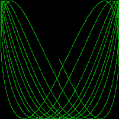

# Lissajous Server

Lissajous Server is a server that produces [lissajous images](https://en.wikipedia.org/wiki/Lissajous_curve).



This is exercise 1.12 from the book The Go Programming Language by Brian W. Kernighan and Alan Donovan.

## Requirements

Make sure you have at least Go 1.21.4 installed on your system before running the program.

## How to Run

To run the Lissajous server, use the following command:

```bash
go run lissajousserver.go
```

Then access it in any browser: [http://localhost:8000](http://localhost:8000)

## Optional Parameters

You can alter the following parameters passing as integer params:

### Cycles

Number of complete x oscillator revolutions.
Defaults to cycles=5

### Size

Image canvas covers [-size..+size].
Defaults to size=300

### Nframes

Number of animation frames.
Defaults to nframes=64

### Delay

Delay between frames in 10ms units.
Defaults to delay=8

## Example usage

```url
http://localhost:8000/?size=400&delay=5
```

## Tasks

[x] Modify the Lissajous server to read parameter values from the URL. For example, you might arrange it so that a URL like [http://localhost:8000/?cycles=20](http://localhost:8000/?cycles=20) sets the number of cycles to 20 instead of the default 5. Use the strconv.Atoi function to convert the string parameter into an integer. You can see its documentation with go doc strconv.Atoi.
